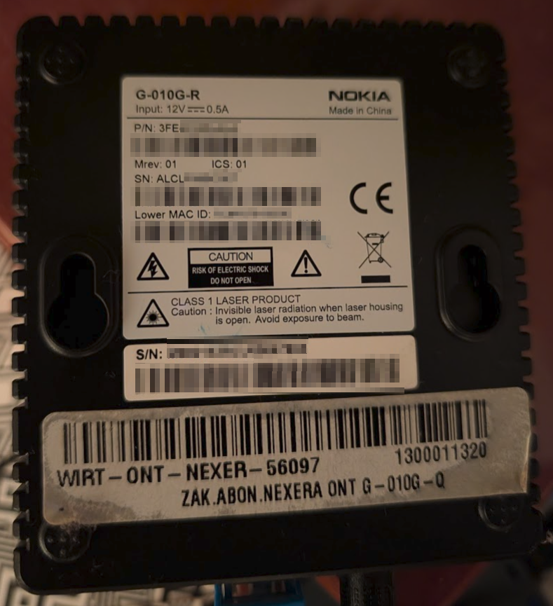
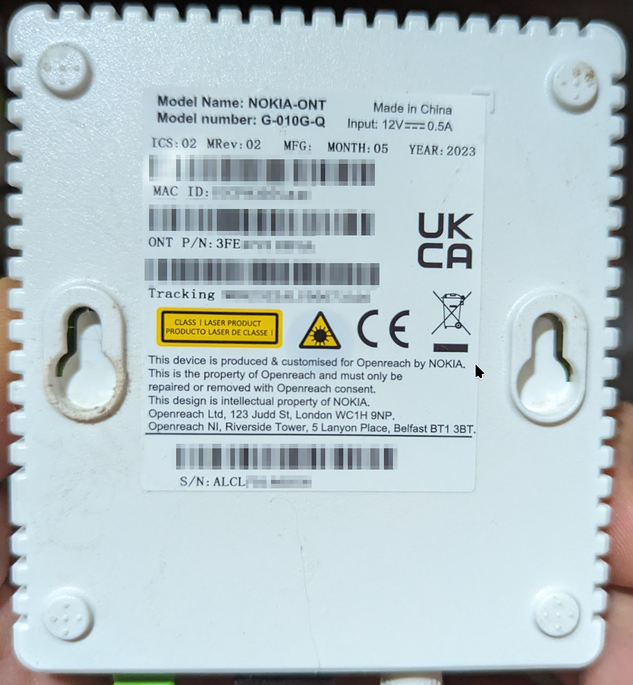

# Replacing Nokia ONT with SFP+ Leox LXT-010S-H

This page documents how to replace ISP issued Nokia ONT (eg. G-010G-Q or G-010G-R) with your own. Here I'll use Leox [LXT-010S-H|https://www.leolabs.pl/ont-leox-lxt-010s-h.html].

## Tested ISPs

These instructions have been tested against:
- Openreach UK (BT but should work with anybody using Openreach's infrastructure)
- Orange Poland (Here too any local ISP using Orange's infra should work)

# But Why ?

Because:
- I want to
- I can
- I don't want to have yet another device in front of my router
- I want to have full control over my network
- etc.

# What's required

- Visual access to the back of the original ONT
- A Linux workstation (because it's: easier, better, nicer, free, etc. )
- Tools: 
 - telnet
 - netcat/nc
 - binwalk
 - strings
 - grep
- (Optionally) SFP to ethernet medium converter
- A router that can take in SFP+ modules eg. a Mikrotik HEXS or RB0009 or similar router.

# Preface

There's already a fair number of blog posts etc. documenting how to do this sort of thing but pretty much all of them go through the case of ONT being Huawei and require almost zero config or using some basic settings which don't really work with Nokia ONTs/ONUs so here I'm documenting the full process of replacing such ISP issued device with your own focusing on most important bits like obtaining the right firmware version etc.

I'm not going to be going extensively through basic network setup like how to setup your network to gain access to the actual ONT web interface because if you're reading this you should know this already.

# Discovery and initial access

## Networking setup

If you have access to an SFP to ethernet [media converter like eg this one | https://www.aliexpress.com/item/1005004580254846.html?spm=a2g0o.order_list.order_list_main.9.68b418027pam3h] then you have it easy and you can simply plug the Leox ONT stick into the SFP to ethernet converter, connect it to your workstation and setup your local IP to something from 192.168.100.0/24 subnet. Just not the 192.168.100.1 because that's the stick's IP.

**Note: The advantage of using the medium converter is that you can configure the SFP ONT stick without the need to have the fibre optic cable plugged into it yet.

## Access via a (mikrotik) router
If you only have your target router at hand which will eventually be the one hosting the SFP ONT you can configure yourself a NAT rule to masquarade your LAN ips to one from 192.168.100.0/24 to be able to access the stick. You could also play with bridging ports or with vlans but I'd say NATing is the simplest so something like this should do:

```
/ip firewall nat
add action=masquerade chain=srcnat dst-address=192.168.100.1
```

The above rule will allow your LAN hosts access the ONT stick IP address (192.168.100.1). 

**NOTE: This will ONLY work when the fibre optic cable is plugged into the stick!!! This is due to the (Mikrotik) router only allowing access to the interface once it's up which can only happen if the cable is plugged in.

## Accessing the Leox ONT

The stick's details:
- IP: 192.168.100.1
- user: leox
- password: leolabs_7

You can browse to it by visting: http://192.168.100.1 or telnet to it. Do try both as both access methods will be needed.

## Get the original (ISP provided) ONT details

Examples:




Take a look at the back of your ISP issued ONT. You will find there the following info:

- MAC address (MAC ID) - 12 hex values with no (":" or "-") delimiter. 
- Product number (ONT P/N) - 12 character string usually starting with "3FE"
- Serial number (S/N) - 12 character string starting with "ALCL" 

Bear in mind that depending on your ISP and the ONT version/model there maybe multiple confusing values on various stickers. The above info should give you hints on which ones to look for.

# Initial configuration

In this step you will configure the ONT stick with the values discovered earlier which usually won't be enough to get the full connectivity but we need this to proceed to the next step so follow me!

**NOTE: For best results you should have the fibre optics cable plugged into the SFP ONT module.

## Check the stick status using telnet

Telnet to the Leox ONT stick and have a peek around.


```
telnet 192.168.100.1
Trying 192.168.100.1...
Connected to 192.168.100.1.
Escape character is '^]'.
LXT-010S-H login: leox
Password: 
# ls -al /tmp/
drwxrwxr-x    2 leox     0                0 Jan  1 03:32 .
drwxr-xr-x   12 leox     0                0 Jan  1 00:00 ..
-rw-------    1 leox     0              330 Jan  1 03:32 .ash_history
srwxr-xr-x    1 leox     0                0 Jan  1 00:00 igmp_socket
-rw-r--r--    1 leox     0                0 Jan  1 00:00 omcilog
-rw-r--r--    1 leox     0                0 Jan  1 00:00 omcilog.par
---x------    1 leox     0               46 Jan  1 00:00 pmap_deconfig
-rw-------    1 leox     0              297 Jan  1 03:23 temp_omcicli_iQkC2S

```

So ther are a few commands you should run to check you initial state

- dump the (whole) flash: `flash all`
- show the current OMCI firmware version settings: `flash all |grep OMCI_SW_VER` 
- show the currently set serial number: `flash all |grep GPON_SN`
- get the GPON vlan tag info: `omcicli mib get 84`
- check the OLT vendor id: `omcicli mib get 131`
- check GPON ONU state: `diag gpon get onu-state`
- list the /tmp directory: `ls -al /tmp/`


At this point the `omcicli mib get 84` and `omcicli mib get 131` will not show you much if anything other than the short header. That's expected.

## Login to the web interface

You can also have a browse around in the web interface available under: http://192.168.100.1 . 

**NOTE: Don't change anything yet.


# The problem

So at this point you may think that if you retype all the settings from the back of the original ONT into the Leox ONT SFP module it should just work... well sadly it wont! This is due to the fact that the ONU (the ISP part of the connection) is expecting the ONT to be at a certain firmware version. You maybe able to find some working versions for your ISP but the ultimately if got this far you may just as well discover it yourself.

# Configure the ONT stick

## GPON Settings

1. Login to the web interface under http://192.168.100.1 and click on Admin->"GPON Settings". 
2. Make sure you have the "OMCI OLT Mode:" option set to "Customized Mode"
3. Click on "Apply Changes"

## OMCI Information

Telnet to the stick
```
telnet 192.168.100.1
Trying 192.168.100.1...
Connected to 192.168.100.1.
Escape character is '^]'.
LXT-010S-H login: leox
Password: 
# 
```

Now you can start configuring your ONT stick 

### Set the MAC address

Use the "MAC ID" value from the original Nokia ONT in place of AABBCCDDEEFF

```
flash set ELAN_MAC_ADDR AABBCCDDEEFF 
```


Set the OMCI and GPON values:

### GPON serial number

Use the S/N value from the back of the original Nokia ONT in place of ALCLXXXXXXXX
```
flash set GPON_SN ALCLXXXXXXXX
```

### GPON Vendor ID

```
flash set PON_VENDOR_ID ALCL
```

### GPON ONU Model

Use the model number from your original Nokia ONT 

```
flash set GPON_ONU_MODEL G-010G-R
```

### Set OMCI Hardware version

Use the "ONT P/N" value from your original Nokia ONT in place of 3FXXXXXXXXXX

```
flash set HW_HWVER 3FXXXXXXXXXX
```

### Set the OMCI software versions

At this point you have to populate the OMCI software versions. You can do this via the web interface or via telnet like all the other values.
To do it via the web interface go to: Admin->OMCI Information and set the:
- OMCI software version 1
- OMCI software version 2

...fields.

Once set click on the "Apply Changes" button.

#### Orange Poland

```
flash set OMCI_SW_VER1 3FE49717AOCK71
```

#### Openreach UK

```
flash set OMCI_SW_VER2 3FE45655BOCK91
```

### Critical point

If you've followed everything as above and correctly set the OMCI and GPON values as well as applied the OMCI software versions via the Web interface or simply clicked on "Apply Changes" in the OMCI Information screen of the web interface after setting the `OMCI_SW_VER*` values via the `flash set` command your ONT stick will probably start connecting. If you're lucky and you've used one of the OMCI_SW_VER values above because your ISP is either Orange PL or Openreach UK then when you run:

```
diag gpon get onu-state
gpon get onu-state 
ONU state: Operation State(O5) 
RTK.0> command:# 
```

You've got `Operation Stage(05)` which is a great news but you should also run `omcicli mib get 84` and `omcicli mib get 131` and you should see something like this:

```
# omcicli mib get 84
XXXXXXXXXXXXXXXXXXXXXXXXXXXXXXXXX
VlanTagFilterData
XXXXXXXXXXXXXXXXXXXXXXXXXXXXXXXXX
=================================
EntityID: 0x1102
FilterTbl[0]: PRI 0,CFI 0, VID 151
FwdOp:  0x10
NumOfEntries: 1
=================================
=================================
EntityID: 0x1103
FilterTbl[0]: PRI 0,CFI 0, VID 13
FwdOp:  0x10
NumOfEntries: 1
=================================
=================================
EntityID: 0x110b
FilterTbl[0]: PRI 0,CFI 0, VID 13
FilterTbl[2]: PRI 0,CFI 0, VID 151
FwdOp:  0x10
NumOfEntries: 2
=================================
# 
# 
```

```
# omcicli mib get 131
XXXXXXXXXXXXXXXXXXXXXXXXXXXXXXXXX
OltG
XXXXXXXXXXXXXXXXXXXXXXXXXXXXXXXXX
=================================
EntityId: 0x00
OltVendorId: ALCL
EquipId:                     
Version: 
ToDInfo:
        Sequence number of GEM superframe: 0x0
        Timestamp: secs 0, nanosecs 0
=================================
```

At this point your ONT has successfully connected but if you don't see the above output and instead just see short headers following each command keep reading.


#### OMCI_SW_VER* mismatch

If in the previous step you didn't get a long output similar to the one posted your ISP's OLT may requre your ONT at a different version. You may notice that:
- Your Leox ONT has become very, very **SLOW. 
- Your Leox ONT has rebooted or disconnted your from telnet.
- if you run this:
```
ls -al /tmp/
```

among the files listed may be one named: `img.tar` which file size is constantly increasing and maybe starting from 0 after the stick randomly rebooted.

Basically what happens is that your stick is trying to download the firmware file. Because the OMCI_SW_VER* is not what OLT expects it will push a new file everytime initial connections is brought up. The stick will stream/download the firmware file and store it as /tmp/img.tar. We have to pull the firmware from the stick, try to extract it and get the version from it to update our OMCI_SW_VER values.

#### Preparing for the firmware streaming
At this point the stick is still very slow but you have to be patient and telnet to it. Confirm that there is indeed `/tmp/img.tar` file with ever increasing file size. If there isn't some of the previously set OMCI* and GPON* flash values may have been set incorrectly. Double check them and if sure that all is good click on "Apply Changes" button on the `Admin->OMCI Information` screen. 

The firmware file is about 4MB big. It's best to wait until a new download has been started (the process loops forever if the there is a SW_VER mismatch) then do the following:

##### Streaming server

Once telneted to the Leox ONT SFP module run this command:

```
( cat /tmp/img.tar ; tail -f /tmp/img.tar  ) | nc -l -p 1234
```

This will start a netcat process waiting for connections on port `1234` and as soon as one connects it will start streaming the file.

##### Streaming client (workstation)

As soon as you've started the streaming server process in the previous step run this on your Linux workstation:

```
nc -v 192.168.100.1 1234 > ~/img.tar
```

This will stream the firmware from the ONT stick to the workstation. 

You can observe the progress by eg.
```
watch ls -al /img.tar
```

Keep watching the file size and if it stops increasing you can stop the server/client processes and continue to the next step.


##### Extracting the firmware

Unfortunately I haven't found a clean way to fully extract the firmware to a usable image files but what we'll get from here will be enough for us to work with.
So you must install yourself `binwalk` tools and any prerequisites of it. How to do this I leave to your own initiative.

Run this to extract the firmware:

```
binwalk -e ~/img.tar
```

This will create you `~/_img.tar.extracted` directory with a bunch of files. Pretty much all of these files will be a pair of hex name and the same with .zlib extension. We don't need the .zlib files so  for simplicity you can move them to it's own dir like this:

```
mkdir ~/_img.tar.extracted/zlib
mv -v ~/_img.tar.extracted/*.zlib ~/_img.tar.extracted/zlib/
```

##### Extracting our SWVER 

Now we can finally extract the SWVER...

```
strings ~/_img.tar.extracted/* | grep "SWVER="
```

This should produce something like this:

```
SWVER=3FEXXXXXXXXXXX
```

Where the `3FEXXXXXXXXXXX` is the version we need update the `OMCI_SW_VER*` values either via the `flash set` command or via the web interface in `Admin->OMCI Information`


Happy hacking!


# Credits
A lot of the above info has been done with the help of Msh100 who helped me extract the info from on my own ONT in Openreach network. I then tested the same on the Orange PL network where I refined the process.

